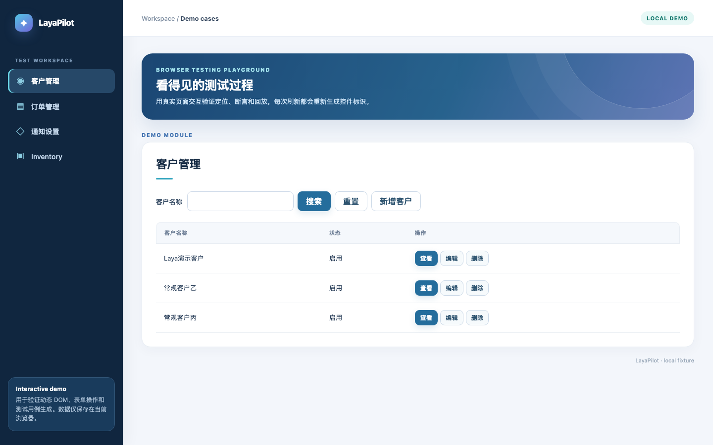

# LayaPilot 智能自动化测试

[English](README.en.md) · [架构与扩展](docs/architecture.md) · [Roadmap](ROADMAP.md)

从浏览器页面**生成可回放的 Excel 测试用例**，或读取已有 Excel 执行测试。当前版本使用 Playwright 驱动浏览器，使用本地 Laya 或兼容的决策 API 选择有歧义的控件。执行后的断言由页面状态判断，不把模型判断直接当成通过结果。

项目包含一个可独立运行的公开 demo；企业专用类集适配器、内部地址、账号和模型网关配置均未纳入本仓库。**当前只实现 Playwright 浏览器驱动和 Laya 决策协议。** browser-use、Jev API 等列在 [Roadmap](ROADMAP.md)，尚不能通过改一个配置项直接运行。



## 介绍视频

[](https://www.youtube.com/watch?v=aIZEEcTGM0w)

[在 YouTube 观看介绍视频](https://www.youtube.com/watch?v=aIZEEcTGM0w)

## 功能

| 入口 | 能力 | 产物 |
| --- | --- | --- |
| `--mode generate` | 观察页面并尝试页签、列表、筛选、表单校验及新增/查询/查看/修改/删除 | 17 列 Excel、报告、浏览器证据 |
| `--mode execute` | 重新定位 DOM 并回放生成的 Excel | 独立的 `执行结果.xlsx`、报告、证据 |
| `--excel` | 读取现有自然语言 Excel，默认只选来源结果为 `pass` 的行 | JSON、CSV、Markdown 报告 |

生成器只把**实际操作成功且页面断言通过**的流程写入 Excel。生成的工作簿有可见的步骤与预期结果，以及隐藏的结构化回放步骤；可见用例与隐藏步骤不一致时会拒绝回放。回放会创建本轮唯一命名的测试记录，并在支持的流程中清理它。错误报告可包含失败步骤、页面异常、控制台错误、接口 4xx/5xx 和截图。它不是对任意网站、任意 Excel 的完整自动化保证；审批、多账号权限、文件导入等业务流程仍需要专门适配。

## 安装与电脑配置

- Node.js **20+**、Python **3.10+**；建议 Python 3.11 或 3.12。当前浏览器实现需要 Playwright Chromium。macOS、Linux 和 Windows 可用 `node runner.mjs`；`run.sh` 是 macOS/Linux 的便捷入口。
- **建议优先在本机安装官方 Laya 多语言模型**，中文和英文页面共用同一模型。官方 Python 包为 `laya`，模型为 [`convaiinnovations/laya-multilingual`](https://huggingface.co/convaiinnovations/laya-multilingual)。第一次运行需要下载模型；之后可使用本地缓存或把 `LAYA_MODEL` 指向已下载目录。不要把模型权重提交到 Git。
- 本地模型的**实践建议**：4 核以上 CPU、**16 GB 内存**、至少 **5 GB 可用磁盘**，不要求独立显卡。本项目曾在 Apple Silicon M4 / 16 GB 上用 CPU 完成验证，模型目录约 647 MB，首次加载约 27 秒；这不是官方最低配置，也不能保证其他机器的速度。8 GB 机器可能因 Python、浏览器和模型同时运行而吃紧。API 模式不加载本地模型，仍需要 Node、浏览器和安装了 `openpyxl` 的 Python。

```bash
git clone <your-repository-url> laya-pilot
cd laya-pilot
npm install
npx playwright install chromium
python3.11 -m venv .venv
.venv/bin/python -m pip install -r requirements-local.txt
```

Windows 使用 `.venv\Scripts\python.exe` 并通过 `--python` 指定。只使用 API 决策模式时，安装 `requirements.txt` 即可，无须 `requirements-local.txt`。Laya 包和模型的最新安装说明以[官方模型卡](https://huggingface.co/convaiinnovations/laya-multilingual)及[官方 Python 项目](https://github.com/NandhaKishorM/laya)为准。

## 先体验公开 demo

在一个终端启动 demo，在另一个终端运行测试。demo 的客户数据保存在当前浏览器的 localStorage；页面每次打开会重新生成部分 DOM ID。

```bash
npm run demo
./run.sh --mode generate --url http://127.0.0.1:8765/customers \
  --case-file generated-cases/customers.xlsx
./run.sh --mode execute --case-file generated-cases/customers.xlsx \
  --url http://127.0.0.1:8765/customers
```

默认显示浏览器；稳定后可加 `--headless`。也可用 `./run.sh --excel examples/demo-cases.xlsx --url http://127.0.0.1:8765/customers` 体验现有 Excel 的通用执行器。生成模式会真实点击新增、修改和删除，请只对专用测试环境使用。

## 配置自己的系统

复制 [`config.example.json`](config.example.json) 为 `config.local.json`，填写页面地址和运行选项；`config.local.json` 已忽略。复制 [`.env.example`](.env.example) 为 `.env.local`，可保存仅在本机使用的密码和 API 密钥；启动时自动读取，不执行其中的 shell 命令。命令行参数优先于 shell 环境变量，shell 环境变量优先于 `.env.local`，后者优先于 JSON 配置。密码与 API 密钥**只通过环境变量、`.env.local` 或终端隐藏输入**提供，不支持写入 JSON 配置。

```bash
./run.sh --mode generate --config config.local.json --manual-login
./run.sh --mode execute --config config.local.json \
  --case-file generated-cases/customers.xlsx
```

自动登录可传 `--user` 或 `TEST_USER`，密码使用 `TEST_PASSWORD`（可在 `.env.local` 中设置）或运行时隐藏输入。API 模式需配置 `LAYA_API_BASE`、`LAYA_API_MODEL` 和 `LAYA_API_KEY`：

```bash
export LAYA_API_BASE='https://your-gateway.example/v1'
export LAYA_API_MODEL='your-decision-model'
export LAYA_API_KEY='your-secret-key'
./run.sh --mode generate --provider api --url 'https://your-test-app.example/module' --manual-login
```

本地模式默认使用 `convaiinnovations/laya-multilingual`；可以设置 `LAYA_MODEL=/path/to/model` 和 `LAYA_PYTHON=/path/to/python`。浏览器默认是 Playwright 自带 Chromium；安装本机 Chrome 后可选 `--browser-channel chrome`。`--browser-provider` 当前仅接受 `playwright`，其它值会明确报错。`--template-excel` 可指定已有的 17 列模板；不指定时生成项目自带的同列结构，不引用任何个人文件。

运行证据默认写入 `runs/`，生成文件默认写入 `generated-cases/`，两者均不纳入 Git。生成的 Excel 和报告可能含目标 URL、页面文本或测试数据，公开前请自行检查。完整 CLI 参数运行 `./run.sh --help`。

## 开发与限制

```bash
npm test
```

当前通过 DOM、标签、ARIA 角色和部分常见组件类名定位控件。页面动态重渲染后会重新观察；Canvas、封闭 Shadow DOM、缺少语义的自定义控件及复杂跨账号流程需要新增适配。架构、驱动扩展点和现有实现边界见[架构文档](docs/architecture.md)。

MIT License。Laya、Playwright 及模型权重分别遵循各自许可证。
